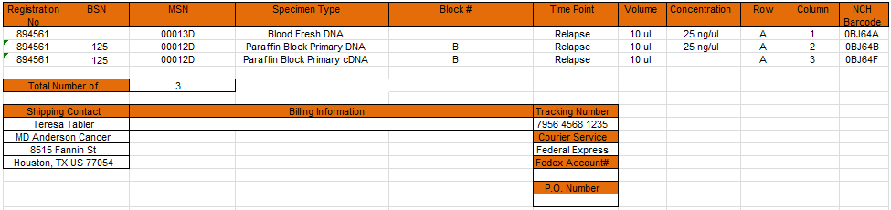
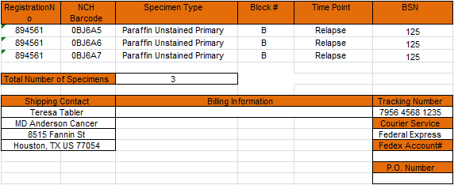
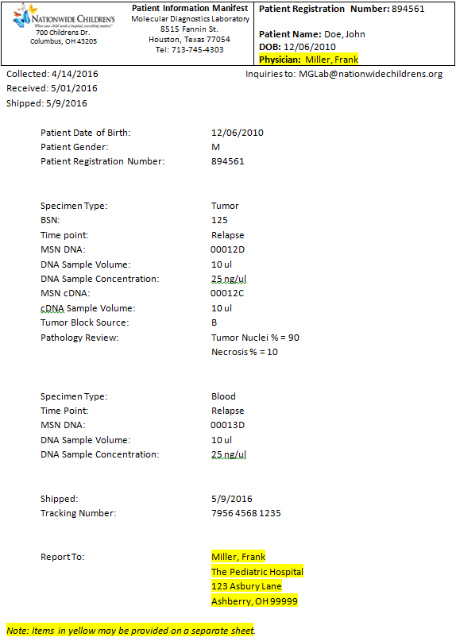

# Scenario NCH-1
Reference Baseline - All received in same shipment; processed as expected; shipped as expected

---
#### Workflow
1. Blood and Tumor received in same shipment
* Specimens accessioned into STARS
* Blood sent to MGL (for DNA extraction, etc.) 
* Block sent to Core Morph (to cut slides)
* Paperwork given to coordinator (next day)
* Paperwork QC'd against STARS accessioning info
* STARS poller sends specimen received message; See [NCH-1-IM-1](#nch-1-im-1)
* Stained slide sent to BPC
* Stained slide sent to path reviewer
* Block sent to Core Morph when path review complete
* Scrolls cut; Unstained slides cut sent to BPC
* Slides held by BPC (for later shipment to MDA)
* Scrolls sent to MGL for extraction
* Block remaining, if any, banked at BPC
* MGL extracts DNA from blood and records yield, QC, etc. in STARS
* MGL extracts DNA, RNA from tumor and records yield, QC, etc. in STARS
* MGL creates cDNA from extracted tumor RNA and records QC in STARS
* MGL signing director reviews and approves QC documentation ("sign off")
* Shipment in STARS created to include: Aliquot of blood DNA, Aliquot of tumor DNA, Aliquot of tumor cDNA, Tumor slide(s)
* STARS poller sends specimen shipped message; See [NCH-1-IM-2](#nch-1-im-2)

---
#### Labels and Manifests

###### Label - Sequencing Specimen

| FIELD          | SAMPLE VALUE(S) | NOTES          |
|----------------|-----------------|----------------|
| Registration # | 894561          | ("Patient ID") |
| NCH Barcode    | 0BJ64A          |                |
| MSN            | 00013D          |                |
| 2D Barcode     | 00013D          | (MSN)          |
| Specimen Type  | Blood Fresh DNA |                |
| Concentration  | 25 ng/ul        |                |
| Yield          | 10 ul           |                |

---
###### Sample Shipping Manifest - NUCLEIC ACIDS


---
###### Sample Shipping Manifest - SLIDES


---
###### Sample Shipping Manifest - PATIENT INFO


---
##### Sample Integration Message(s)

###### NCH-1-IM-1
```json
{
  "header": {
    "msg_guid": "5c64192f-8a25-4874-9db6-fd55c398822d",
    "msg_dttm": "2016-04-25T18:42:13+00:00"
  },
  "specimens_received": [
    {
      "patient_id": "17364",
      "collection_grouping_id": "CGID-123456",
      "type": "Blood",
      "disease_status": "Normal",
      "internal_use_only": {
        "stars_patient_id": "ABCXYZ",
        "stars_specimen_id": "ABCXYZ-ABC123",
        "stars_specimen_type": "Blood Fresh",
        "received_ts": "2016-04-25T15:17:11+00:00",
        "qc_ts": "2016-04-25T16:21:34+00:00"
      }
    },
    {
      "patient_id": "17364",
      "collection_grouping_id": "CGID-123457",
      "type": "Tissue",
      "disease_status": "Diseased",
      "internal_use_only": {
        "stars_patient_id": "ABCXYZ",
        "stars_specimen_id": "ABCXYZ-ABC124",
        "stars_specimen_type": "Paraffin Block Primary",
        "received_ts": "2016-04-25T15:17:11+00:00",
        "qc_ts": "2016-04-25T16:21:34+00:00"
      }
    }
  ]
}
```

##### NCH-1-IM-2
```json
(To be defined)
```
