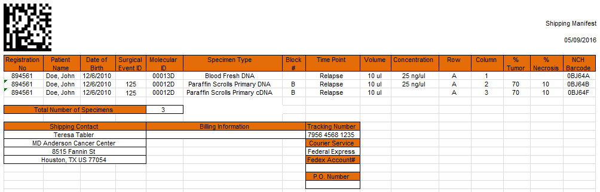

# Scenario NCH-1
*Reference Baseline - All received in same shipment; processed as expected; shipped as expected*

---
#### Workflow
1. Blood and Tumor received in same shipment
* Specimens accessioned into STARS
* Blood sent to MGL (for DNA extraction, etc.) 
* Block sent to Core Morph (to cut slides)
* Paperwork given to coordinator (next day)
* Paperwork QC'd against STARS accessioning info
* STARS poller sends specimen received messages; See [NCH-1-IM-1](#nch-1-im-1)
* Stained and unstained slides sent to BPC
* Stained slide sent to path reviewer
* Block remaining, if any, banked at BPC
* Slides held by BPC (for later shipment to MDA for IHC)
* Unstained slides cut for extraction sent to Core Morph 
* Unstained slides scrapings sent to BPC
* Unstained slide scrapings sent to MGL for extraction
* MGL extracts DNA from blood and records yield, QC, etc. in STARS
* MGL extracts DNA, RNA from tumor and records yield, QC, etc. in STARS
* MGL creates cDNA from extracted tumor RNA and records QC in STARS
* MGL signing director reviews and approves QC documentation ("sign off")
* Shipment in STARS created to include: Aliquot of blood DNA, Aliquot of tumor DNA, Aliquot of tumor cDNA, Tumor slide
* STARS poller sends specimen shipped messages; See [NCH-1-IM-2](#nch-1-im-2)

---
#### Specimen Labels - Sequencing

###### Specimen #1 (DNA from Blood)

||||
|----------------|-----------------|----------------|
| **Registration #** | 894561          | _(Patient ID)_ |
| **NCH Barcode**    | 0BJ64A          |                |
| **Molecular ID**   | 00013D          |                |
| **2D Barcode**     | 00013D          | _(Molecular ID)_          |
| **Specimen Type**  | Blood Fresh DNA |                |
| **Concentration**  | 25 ng/ul        |                |
| **Volume**        | 10 ul           |                |

###### Specimen #2 (DNA extracted from Tumor)

||||
|----------------|-----------------|----------------|
| **Registration #** | 894561          | _(Patient ID)_ |
| **Surgical Event ID** | 125             |                |
| **NCH Barcode**    | 0BJ64B          |                |
| **Molecular ID**   | 00012D          |                |
| **2D Barcode**     | 00012D          | _(Molecular ID)_  |
| **Specimen Type**  | Paraffin Scroll Primary DNA |    |
| **Concentration**  | 25 ng/ul        |                |
| **Volume**          | 10 ul           |                |

###### Specimen #3 (cDNA generated from Tumor)

||||
|----------------|-----------------|----------------|
| **Registration #** | 894561          | _(Patient ID)_ |
| **Surgical Event ID** | 125          |                |
| **NCH Barcode**    | 0BJ64F          |                |
| **Molecular ID**   | 00012C          |                |
| **2D Barcode**     | 00012C          | _(Molecular ID)_   |
| **Specimen Type**  | Paraffin Scroll Primary cDNA |   |
| **Concentration**  |                 |                |
| **Volume**          | 10 ul           |                |

#### Specimen Labels - Slides

###### Slide Specimen #1

||||
|----------------|-----------------|----------------|
| **Registration #** | 894561          | _(Patient ID)_ |
| **Surgical Event ID** | 125          |                |
| **NCH Barcode**    | 0BJ6A5          |                |
| **2D Barcode**     | 0BJ6A5          | _(NCH Barcode)_     |
| **Specimen Type**            | Paraffin Unstained Primary          |                |
| **Block #**     | B          |           |

###### Slide Specimen #2

||||
|----------------|-----------------|----------------|
| **Registration #** | 894561          | _(Patient ID)_ |
| **Surgical Event ID** | 125          |                |
| **NCH Barcode**    | 0BJ6A6          |                |
| **2D Barcode**     | 0BJ6A6          | _(NCH Barcode)_          |
| **Specimen Type**            | Paraffin Unstained Primary          |                |
| **Block #**     | B          |           |

###### Slide Specimen #3

||||
|----------------|-----------------|----------------|
| **Registration #** | 894561          | _(Patient ID)_ |
| **Surgical Event ID** | 125          |                |
| **NCH Barcode**    | 0BJ6A7          |                |
| **2D Barcode**     | 0BJ6A7          | _(NCH Barcode)_          |
| **Specimen Type**            | Paraffin Unstained Primary          |                |
| **Block #**     | B          |           |

---
#### Shipping Manifests

---
###### Sequencing Specimens


---
###### Slide Specimens


---
##### Integration Messages

###### NCH-1-IM-1
_(2 specimen received messages)_
```json
{
  "header": {
    "msg_guid": "5c64192f-8a25-4874-9db6-fd55c398822d",
    "msg_dttm": "2016-04-25T18:42:13+00:00"
  },
  "specimen_received": {
    "study_id": "APEC1621",
    "patient_id": "894561",
    "type": "BLOOD",
    "collection_dttm": "2016-04-25T14:17:11+00:00",
    "received_dttm": "2016-04-25T15:17:11+00:00",
    "internal_use_only": {
      "stars_patient_id": "ABCXYZ",
      "stars_specimen_id": "ABCXYZ-0AK64L",
      "stars_specimen_type": "Blood Fresh",
      "received_dttm": "2016-04-25T15:17:11+00:00",
      "qc_dttm": "2016-04-25T16:21:34+00:00"
    }
  }
}
```

```json
{
  "header": {
    "msg_guid": "ab6d8d37-caf2-4dbb-a360-0032c7a7a76c",
    "msg_dttm": "2016-04-25T18:42:13+00:00"
  },
  "specimen_received": {
    "study_id": "APEC1621",
    "patient_id": "894561",
    "type": "TISSUE",
    "surgical_event_id": "125", 
    "collection_dttm": "2016-04-25T14:17:11+00:00",
    "received_dttm": "2016-04-25T15:17:11+00:00",
    "internal_use_only": {
      "stars_patient_id": "ABCXYZ",
      "stars_specimen_id": "ABCXYZ-0AK64M",
      "stars_specimen_type": "Paraffin Block Primary",
      "received_dttm": "2016-04-25T15:17:11+00:00",
      "qc_dttm": "2016-04-25T16:21:34+00:00"
    }
  }
}
```

##### NCH-1-IM-2
_(5 specimen shipped messages)_

```json
{
  "header": {
    "msg_guid": "7912901b-7285-40cc-9269-1cae961a0ea7",
    "msg_dttm": "2016-05-01T19:42:13+00:00"
  },
  "specimen_shipped": {
    "study_id": "APEC1621",
    "patient_id": "894561",
    "type": "BLOOD_DNA",
    "molecular_id": "00013",
    "destination": "MDA",
    "carrier": "Federal Express",
    "tracking_id": "7956 4568 1235",
    "shipped_dttm": "2016-05-01T19:42:13+00:00",
    "dna_volume_ul": 10,
    "dna_concentration_ng_per_ul": 25,
    "internal_use_only": {
      "stars_patient_id": "ABCXYZ",
      "stars_specimen_id": "ABCXYZ-0BJ64A"
    }
  }
}
```

```json
{
  "header": {
    "msg_guid": "3037ddec-0081-4e22-8448-721ab4ad76b4",
    "msg_dttm": "2016-05-01T19:42:13+00:00"
  },
  "specimen_shipped": {
    "study_id": "APEC1621",
    "patient_id": "894561",
    "surgical_event_id": "125",
    "molecular_id": "00012",
    "type": "TISSUE_DNA_AND_CDNA",
    "destination": "MDA",
    "carrier": "Federal Express",
    "tracking_id": "7956 4568 1235",
    "shipped_dttm": "2016-05-01T19:42:13+00:00",
    "dna_volume_ul": 10,
    "dna_concentration_ng_per_ul": 25,
    "cdna_volume_ul": 10,
    "internal_use_only": {
      "stars_patient_id": "ABCXYZ",
      "stars_specimen_id_dna": "ABCXYZ-0BJ64B",
      "stars_specimen_id_cdna": "ABCXYZ-0BJ64F"
    }
  }
}
```

```json
{
  "header": {
    "msg_guid": "37c491ec-d91a-4e95-a0cf-291dadf60b2f",
    "msg_dttm": "2016-05-02T18:30:17+00:00"
  },
  "specimen_shipped": {
    "study_id": "APEC1621",
    "patient_id": "894561",
    "surgical_event_id": "125",
    "slide_barcode": "0BJ6A5",
    "type": "SLIDE",
    "destination": "MDA",
    "carrier": "Federal Express",
    "tracking_id": "1234 1234 1234",
    "shipped_dttm": "2016-05-02T18:30:17+00:00",
    "internal_use_only": {
      "stars_patient_id": "ABCXYZ",
      "stars_specimen_id": "ABCXYZ-0BJ6A5"
    }
  }
}
```

```json
{
  "header": {
    "msg_guid": "0cbfe261-293b-4ef2-ade6-eec2e342bb57",
    "msg_dttm": "2016-05-02T18:30:17+00:00"
  },
  "specimen_shipped": {
    "study_id": "APEC1621",
    "patient_id": "894561",
    "surgical_event_id": "125",
    "slide_barcode": "0BJ6A6",
    "type": "SLIDE",
    "destination": "MDA",
    "carrier": "Federal Express",
    "tracking_id": "1234 1234 1234",
    "shipped_dttm": "2016-05-02T18:30:17+00:00",
    "internal_use_only": {
      "stars_patient_id": "ABCXYZ",
      "stars_specimen_id": "ABCXYZ-0BJ6A6"
    }
  }
}
```

```json
{
  "header": {
    "msg_guid": "5c5f38ea-c2b4-4519-b252-82d8b8043975",
    "msg_dttm": "2016-05-02T18:30:17+00:00"
  },
  "specimen_shipped": {
    "study_id": "APEC1621",
    "patient_id": "894561",
    "surgical_event_id": "125",
    "slide_barcode": "0BJ6A7",
    "type": "SLIDE",
    "destination": "MDA",
    "carrier": "Federal Express",
    "tracking_id": "1234 1234 1234",
    "shipped_dttm": "2016-05-02T18:30:17+00:00",
    "internal_use_only": {
      "stars_patient_id": "ABCXYZ",
      "stars_specimen_id": "ABCXYZ-0BJ6A7"
    }
  }
}
```
